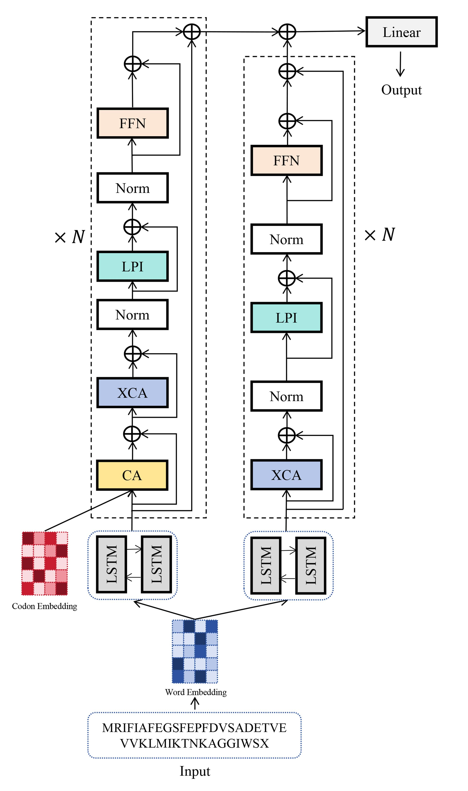

# Deep-XCCA
## Overview
Repository for the application of Deep-XCCA. Messenger RNA (mRNA)-based vaccines have been demonstrated as a promising technology for preventing viral infections due to their safety, rapid production, high potency, and ease of industrialization. There are still some challenges faced by mRNA vaccine design, one of which is how to optimize the coding sequence (CDS) of mRNA to improve its translation efficiency. Here, we proposed a cross-covariance codon attention (XCCA) mechanism to represent codon selection probabilities for each amino acid of the inputted protein, and then based on XCCA we developed a deep learning method called Deep-XCCA for CDS optimization, which was specifically designed to learn the long-term dependencies both in the amino acid and the codon sequences.   



## Functions
```bash
test.py_ codes for predict.  
model/attention.py_ codes for Deep-XCCA attention.  
model/wordsequence.py_ codes for Deep-XCCA model.  
utils/data.py_ codes for input embedding vectors and 64-possible codons as embedding vectors.  
utils/metric.py_ codes for evaluation metric.
```

## Model_weights
[model weights](https://pan.baidu.com/share/init?surl=tXn8EllT9gwdm8gsebI0PA&pwd=1310)

## System_Requirements
### 1.Hardware requorements
Only a standard computer with enough RAM to support the in-memory operations is required.  

### 2.Software requirements
#### OS requirements
#### The codes are tested on the following Oses:
(1)	Linux x64  
(2)	Windows 10 x64  
#### And the following x86_64 version of Python:
Python 3.X  
#### Python dependencies:
(1)	torch  
(2)	Bio   
(3)	torchvision 

## Installation_Guide
### Download the codes
```bash
git clone https://github.com/SJGLAB/Deep-XCCA.git
```
### Prepare the environment
We recommend you to use Anaconda to prepare the environments.
```bash
conda create -n Deep-XCCA python=3.10  
conda activate Deep-XCCA  
pip install torch==2.4.0 torchvision==0.19.0 torchaudio==2.4.0 --index-url https://download.pytorch.org/whl/cu121    
pip install Bio
```

## Usage and Demo
### Example of Running Command
```bash
python test.py --status dev --batch_size 8 --hidden_dim 3000 --word_emb_dim 3000 --lstm_layer 4 --load_model_dir w3000_xlxx_num20.model --dset_dir w3000_xlxx_num20.dset
```

## Thanks
We build out model based on the architecture [code](https://github.com/Devil625/Codon_Optimization)

## Contact Us
If you have any questions in using Deep-XCCA, contact us.

